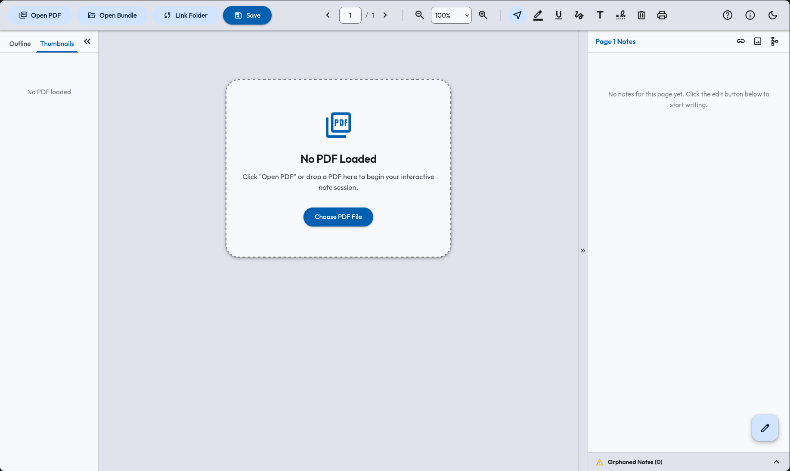
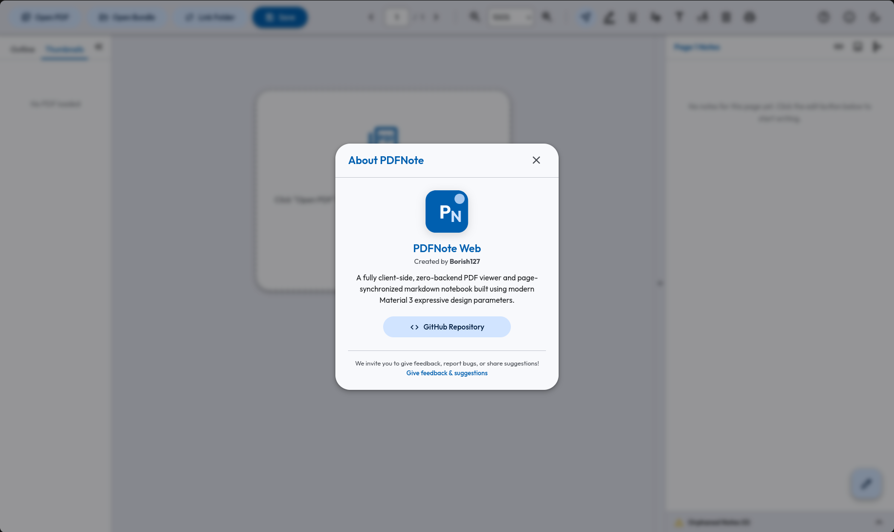
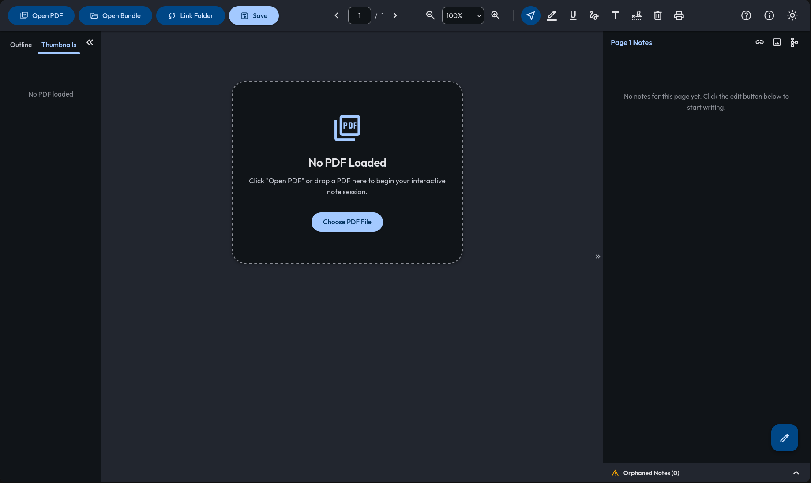
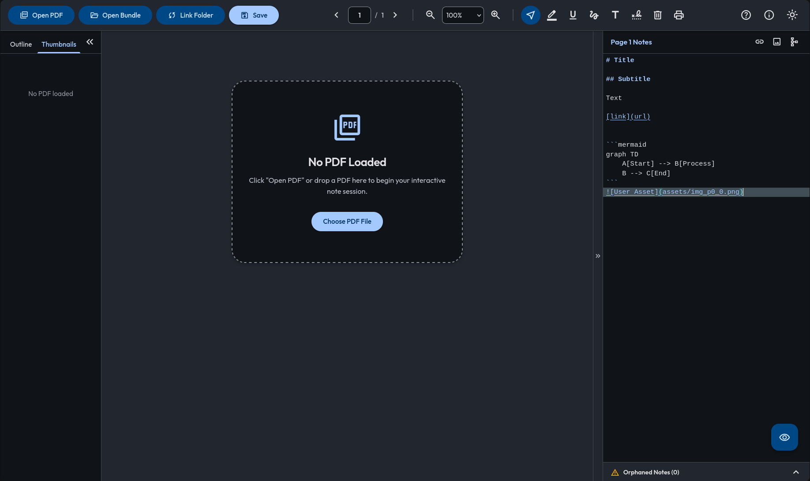
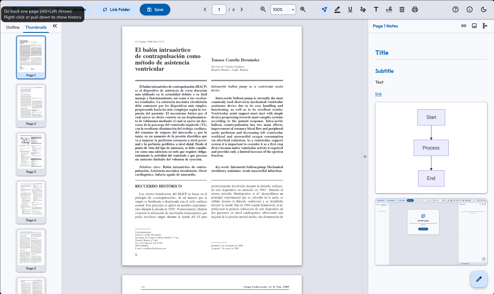

# PDFNote Web

A synchronized PDF viewer and page-by-page Markdown notebook. Easily read, annotate, and take rich, structured notes dynamically linked to each page of your PDF documents.



<table>
    <tr>
        <td></td>
        <td></td>
    </tr>
    <tr>
        <td></td>
        <td></td>
    </tr>
</table>

## Usage

PDFNote Web runs entirely in your browser. You can access and use the live application directly here:

[**https://borish127.github.io/PDFNote_web/**](https://borish127.github.io/PDFNote_web/)

## Features

* **Page-by-Page Synchronization:** Taking notes on the Markdown workspace automatically binds them to the active PDF page. Advancing or switching pages automatically saves the active note and loads the corresponding notes page.
* **Rich Markdown Editor:** A fast CodeMirror 6 markdown editor equipped with formatting accelerators (Headers, Bold, Italic, Code blocks, Lists, Links, Images, and Mermaid charts).
* **Click-to-Expand Lightbox:** Click on any image or Mermaid diagram in markdown visualization mode to open it in a beautiful full-screen blurred lightbox viewer. Supports keyboard dismissals (`Escape` key).
* **Visual PDF Annotations:** Draw directly on the PDF, highlight or underline text, place custom text overlays, or add digital signatures. Markups scale and align perfectly when zooming or resizing viewports.
* **Local Folder Synchronization:** Connect directly to a folder on your device using the File System Access API. PDFNote will automatically read and auto-save individual markdown pages, annotations, and pasted assets directly to your disk.
* **Session Restoration & Crash Recovery:** Auto-saves your work every 3 seconds to IndexedDB. If you accidentally close the tab or experience a browser crash, the app will prompt you to restore your exact session on reload.
* **100% Client-Side:** No servers, no accounts, and no data collection. All PDF rendering, markdown compilation, and storage operations run locally inside your browser sandbox.

## Local Development

If you want to run or build the application locally:

### 1. Clone the repository
```bash
git clone https://github.com/borish127/PDFNote_web.git
cd PDFNote_web
```

### 2. Install dependencies
```bash
npm install
```

### 3. Run development server
```bash
npm run dev
```

### 4. Build for production
```bash
npm run build
```
The compiled static assets will be outputted to the `dist/` directory, ready to be hosted on any static file provider (e.g. GitHub Pages).

## Feedback & Suggestions

Feedback, bug reports, and suggestions are welcome! Feel free to open an issue or submit a pull request on the repository:

[**https://github.com/borish127/PDFNote_web/issues**](https://github.com/borish127/PDFNote_web/issues)

## License

This project is licensed under the **GNU General Public License v3.0 (GPL-3.0)**. See the `LICENSE` file for more details.
